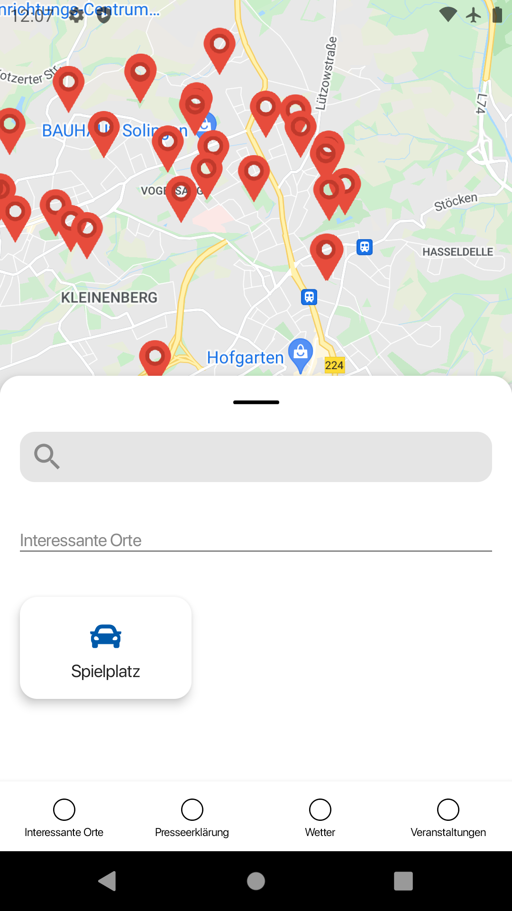
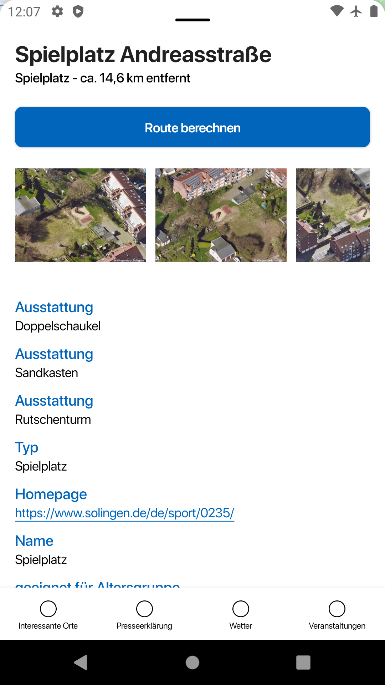

  <h1 style="border:none">Open SmartCity Map Module of the Open SmartCity App</h1>
  

## Important Notice

- **Read-Only Repository:** This GitHub repository is a mirror of our project's source code. It is not intended for direct changes.
- **Contribution Process:** Once our Open Code platform is live, any modifications, improvements, or contributions must be made through our [Open Code](https://gitlab.opencode.de/) platform. Direct changes via GitHub are not accepted.

---

- [Important Notice](#important-notice)
- [Changelog 📝](#changelog-)
- [License](#license)

## Features

- [x] MapScreen marking Points of Interest
- [x] Filter/Search Points of Interest: By category or text
- [x] Show Points of Interest details
- [x] Trace routes to point of interest through Google Maps

## Requirements

- Android 8 Oreo + (SDK 26+)
- Kotln 1.6.0

### Installation

On your module's gradle:

`implementation("future.package.here:version")`

## Other

### Developments and Tests

Any contributing and pull requests are warmly welcome. However, before you plan to implement some
features or try to fix an uncertain issue, it is recommended to open a discussion first. It would be
appreciated if your pull requests could build and with all tests green.

## Changelog 📝

Please see the [Changelog](CHANGELOG.md).

## License

OSCA Server is licensed under the [Open SmartCity License](LICENSE.md).
